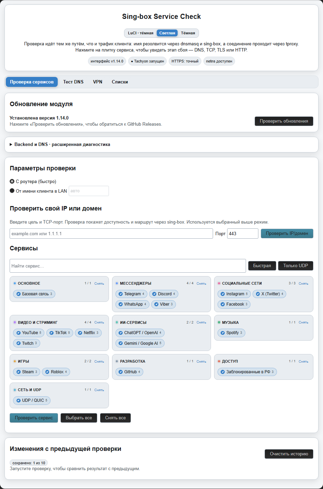
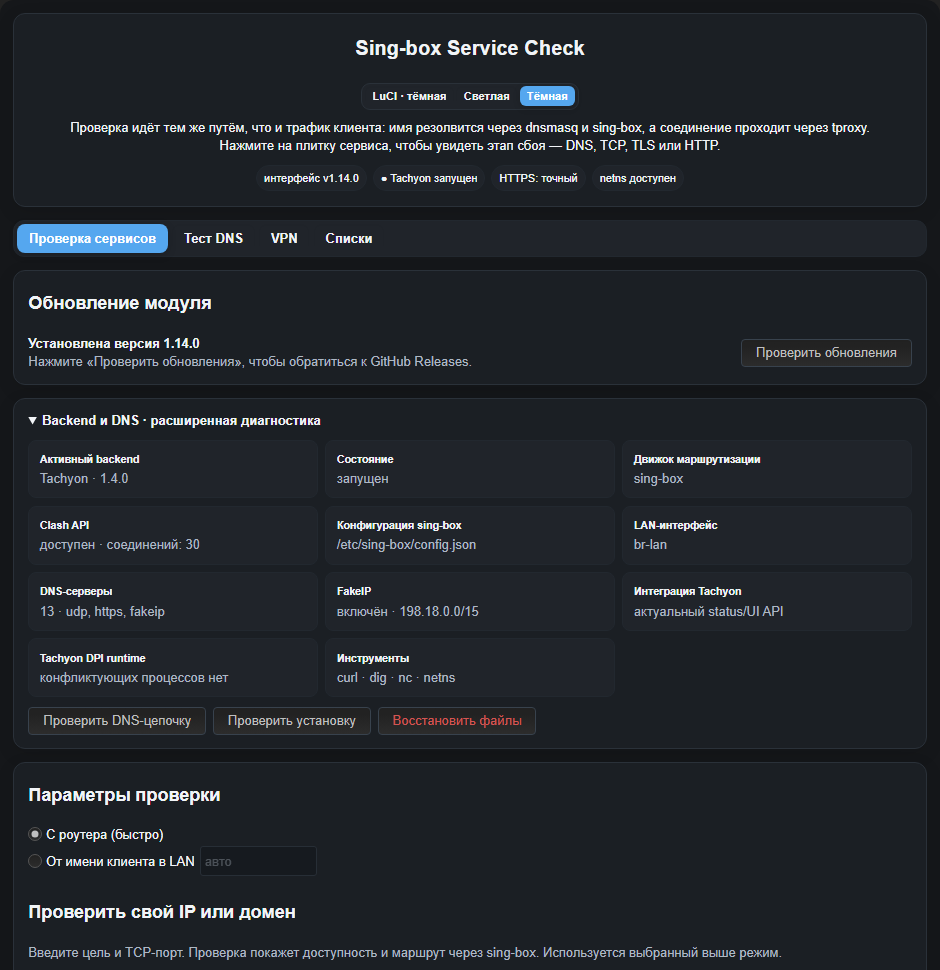
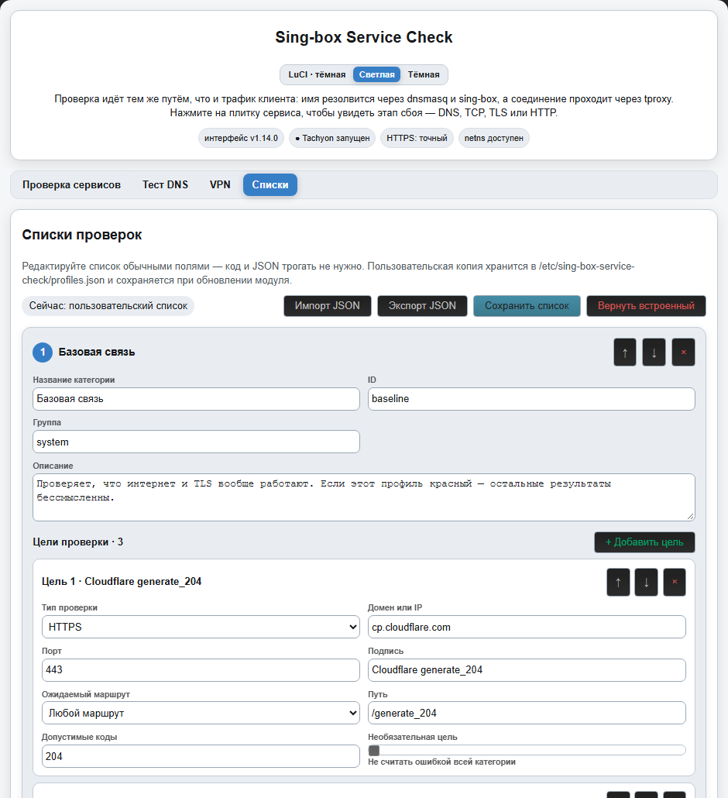

# Sing-box Service Check

LuCI-модуль для OpenWrt, который проверяет доступность сервисов через тот же сетевой маршрут, что и клиентский трафик [Tachyon](https://github.com/Dushnilin/tachyon), Forkop или оригинального [Podkop](https://github.com/itdoginfo/podkop).

Установленный backend определяется автоматически. Для совместимости с существующими установками имя пакета остаётся `luci-app-forkop-servicecheck`, а старая команда `forkop-servicecheck` работает как полный синоним новой `sing-box-service-check`.

Модуль помогает понять, на каком этапе возникает проблема: DNS, TCP/UDP, TLS, HTTP или выбор outbound-маршрута.

## Интерфейс

<p align="center">
  
</p>

<table>
  <tr>
    <td width="50%" valign="top">
      
      <br><sub><b>Подробная диагностика:</b> DNS, TCP, TLS, HTTP и подтверждённый outbound-маршрут.</sub>
    </td>
    <td width="50%" valign="top">
      
      <br><sub><b>Редактор списков:</b> категории и цели настраиваются прямо в LuCI, без ручного редактирования JSON.</sub>
    </td>
  </tr>
</table>

<sub>На скриншотах используются демонстрационные адреса и результаты.</sub>

## Возможности

- Проверка популярных сервисов: Telegram, YouTube, Instagram, Discord, WhatsApp, GitHub и других.
- Отдельная геопроверка Gemini API по ответу Google с локальной настройкой собственного API-ключа.
- Проверка DNS через локальный dnsmasq и sing-box.
- HTTPS-проверки через Tachyon/Forkop/Podkop и tproxy.
- TCP-проверки и best-effort проверки UDP/QUIC.
- Режим проверки с роутера и режим проверки от имени клиента через временный network namespace.
- Отображение fakeip, времени DNS/TCP/TLS/HTTP и выбранного outbound через Clash API.
- Фоновый запуск с отображением прогресса.
- Поле **«Проверить свой IP или домен»**: произвольная цель и TCP-порт проверяются тем же маршрутом, с отдельным вердиктом «через sing-box» или «мимо sing-box».
- Классификация причин ошибок: DNS failure, timeout, TCP refused, TLS reset, ошибки сертификата, HTTP 403/451 и медленные соединения.
- Кнопка **«Починить импорт xHTTP»** с проверкой совместимости, backup и проверкой ucode-компиляции до замены файла.
- Кнопка **«Фикс ping/ICMP для правил подсетей»**: priority-правила TProxy ограничиваются TCP/UDP, чтобы ICMP не получал proxy-маркер.
- Расширяемая панель **«Фиксы Forkop»** показывается только при установленном Forkop: новые исправления добавляются в whitelist-реестр backend и не позволяют запускать произвольные команды из браузера.
- Двусторонние UDP-проверки через DNS в составе обычной проверки сервисов.
- Отдельная вкладка **«Тест DNS»** с замером времени ответа публичных резолверов по UDP, DoH и DoT.
- Ожидаемый маршрут `proxy` или `direct` для каждой цели с отдельным предупреждением, если фактический outbound не совпал или его нельзя подтвердить.
- История десяти последних запусков в оперативной памяти и сравнение статуса, outbound и времени ответа с предыдущим запуском.
- Копирование безопасного текстового отчёта и скачивание JSON для поддержки без ключей, клиентских адресов и разрешённых IP.
- Импорт и экспорт пользовательских списков JSON с проверкой структуры до сохранения.
- Диагностика backend, Clash API, DNS и FakeIP, а также самопроверка и восстановление установки из локальной recovery-копии.
- Вкладка **VPN**: безопасный импорт WireGuard или AWG Tools (AWG 1.5/2.0/3.0) из текста либо файла `.conf`/`.wg`; DNS, `FwMark`, фиксированный `ListenPort` и системные маршруты не изменяются, адреса ограничиваются `/32` и `/128`, интерфейс создаётся только для проверки link/handshake.
- Локальный конвертер **VLESS ↔ sing-box JSON** во вкладке VPN: поддерживает TLS, REALITY, uTLS, ALPN, TCP, WebSocket, gRPC, HTTP/2, HTTPUpgrade и QUIC; ссылки и UUID не покидают браузер.

## Как это работает

Обычная проверка проходит по цепочке:

```text
LuCI → sing-box-service-check → probe.uc
                         → dnsmasq → sing-box → Tachyon/Forkop/Podkop tproxy → сервис
```

В режиме `netns` создаётся временный network namespace с отдельным IP-адресом в LAN. Это позволяет воспроизвести правила маршрутизации, зависящие от source IP клиента.

## Установка

Готовые файлы всех опубликованных версий находятся на странице [GitHub Releases](https://github.com/Hellington-Rey/sing-box-service-check/releases). Для обычного OpenWrt с `opkg` скачайте файл `.ipk` из раздела Assets нужной версии.

Для OpenWrt с opkg:

```sh
opkg install luci-app-forkop-servicecheck_1.11.0-r1_all.ipk
```

Для OpenWrt с apk:

```sh
apk add --allow-untrusted ./luci-app-forkop-servicecheck-1.11.0-r1.apk
```

Установка без пакетного менеджера:

```sh
wget -O- https://raw.githubusercontent.com/Hellington-Rey/sing-box-service-check/main/install-sing-box-service-check.sh | sh
```

Установщик определяет уже установленную версию и сообщает, выполняется ли чистая установка, обновление или переустановка текущей версии. При обновлении он проверяет запуск `dig` и предлагает установить недостающий `bind-dig` либо переустановить несовместимые `bind-libs` и `bind-dig`. В команде `wget | sh` вопрос читается из терминала, а не из канала с установщиком.

## Обновление из LuCI

На вкладке проверки есть блок **«Обновление модуля»**. Кнопка **«Проверить обновления»** обращается только к последнему стабильному GitHub Release этого репозитория. Если опубликована более новая версия, появляется кнопка установки.

Перед запуском загруженного установщика backend:

1. проверяет формат тега версии;
2. сверяет имя и URL asset с официальным адресом релиза;
3. проверяет digest, полученный из GitHub API;
4. повторно вычисляет SHA-256 загруженного файла;
5. проверяет, что версия внутри установщика совпадает с тегом релиза.

Установка выполняется в фоне. Если для новых функций не хватает пакетов, LuCI показывает их список в карточке обновления и включает установку в действие только после подтверждения пользователя. Во время перезапуска `rpcd` LuCI может на несколько секунд потерять связь, после чего страница обновится автоматически.

Те же операции из консоли:

```sh
sing-box-service-check update-check
sing-box-service-check update-start
sing-box-service-check update-status
```

При наличии недостающих зависимостей `update-start` задаёт вопрос в интерактивном терминале. Для сценариев без stdin выбор можно передать явно:

```sh
sing-box-service-check update-start --install-missing
sing-box-service-check update-start --skip-missing
```

## Поддержка Tachyon, Forkop и Podkop

Модуль автоматически выбирает backend по установленному исполняемому файлу. Сначала проверяется `/usr/bin/tachyon`, затем `/usr/bin/forkop` и `/usr/bin/podkop`. Такой порядок нужен после миграции, когда старые бинарники могут остаться рядом с активным Tachyon. Для отладки выбор можно переопределить переменной `FORKOP_SC_BACKEND=tachyon`, `FORKOP_SC_BACKEND=forkop` или `FORKOP_SC_BACKEND=podkop`.

На Tachyon модуль:

- берёт путь к конфигурации Sing-box из `tachyon.settings.config_path`;
- использует `tachyon.settings.source_network_interfaces` для режима клиента;
- проверяет состояние через `tachyon get_status`;
- читает активные соединения через `tachyon clash_api get_connections`;
- не показывает и не разрешает запуск специфичных исправлений Forkop, даже если после миграции остался старый `/usr/bin/forkop`.

На Podkop модуль:

- берёт путь к конфигурации Sing-box из `podkop.settings.config_path`;
- использует `podkop.settings.source_network_interfaces` для режима клиента;
- проверяет состояние через `podkop get_sing_box_status`;
- читает активные соединения через штатный Clash API Sing-box, включая настроенный секрет YACD;
- не показывает вкладку и кнопки исправлений Forkop.

Если одновременно найдены несколько backend, автоматически выбирается Tachyon, затем Forkop, затем Podkop.

На основной вкладке можно ввести домен или IPv4-адрес, указать TCP-порт и нажать **«Проверить IP/домен»**. Модуль проверит DNS и TCP-доступность, затем сопоставит удерживаемое тестовое соединение с Clash API sing-box. Для доменов FakeIP также используется как подтверждение маршрута через sing-box.

Та же проверка из консоли:

```sh
/usr/bin/sing-box-service-check custom example.com 443 router
```

## Маршрут, история и отчёт

В редакторе списков каждой цели можно назначить ожидаемый маршрут: **любой**, **через прокси** или **напрямую**. Проверка отличает сетевую ошибку от ситуации, когда сервис доступен, но ушёл не через тот outbound. Если Clash API не позволил подтвердить путь, результат помечается как неподтверждённый, а не выдаётся за успешное совпадение.

После завершения запуска модуль хранит до десяти кратких результатов в `/var/run/forkop-servicecheck/history.json`. Это tmpfs: история не изнашивает flash и очищается при перезагрузке. В интерфейсе видно, какие сервисы изменили статус, outbound или время ответа. Там же можно очистить историю.

Кнопки отчёта копируют читаемый текст либо скачивают JSON. В отчёт входит только диагностический allowlist полей; Gemini API-ключ, секрет Clash API, IP клиента и разрешённые DNS-адреса не экспортируются.

Консольные команды:

```sh
sing-box-service-check history
sing-box-service-check history-clear
```

## Тест DNS

Отдельная вкладка **«Тест DNS»** отправляет A-запрос выбранного домена публичным DNS-серверам и показывает время ответа, полученные адреса и ошибки отдельно для обычного DNS по UDP, DNS over HTTPS и DNS over TLS. Проверка выполняется в фоне и обновляет результаты по мере прохождения списка.

Для теста нужен `dig` из пакета `bind-dig`. Тот же тест из консоли:

```sh
sing-box-service-check dns example.com
```

Перед запуском приложение проверяет `dig -v`. Если бинарник не загружается из-за несовместимых библиотек BIND, тест не запускается, а интерфейс предлагает точечную переустановку `bind-libs` и `bind-dig` из настроенного репозитория прошивки.

Для замера используется микросекундный режим `dig -u`, поэтому быстрые ответы показываются дробным числом миллисекунд. Если `dig` не вернул собственную метрику, интерфейс помечает приблизительное полное время символом `≈` вместо ложных `0 мс`.

Результаты сортируются по скорости отдельно внутри UDP, DoH и DoT: сначала идут успешные ответы от быстрых к медленным, затем ошибки. При одинаковом времени сохраняется исходный порядок серверов.

## Конвертер VLESS

Во вкладке **VPN** VLESS-ссылку можно преобразовать в отдельный outbound-объект sing-box и обратно. В обратном направлении принимается как один объект `type: "vless"`, так и полный документ с массивом `outbounds`, если VLESS outbound в нём ровно один.

Конвертация выполняется JavaScript-кодом прямо в LuCI: конфигурация, UUID и ключ REALITY не отправляются backend модуля или сторонним сервисам. Поддерживаются только транспорты, которые есть в sing-box: TCP без отдельного transport-блока, WebSocket, gRPC, HTTP, HTTPUpgrade и QUIC. Для неподдерживаемого транспорта интерфейс показывает ошибку; dial- и route-поля полного конфига не переносятся в VLESS URI, потому что у формата ссылки нет соответствующих параметров.

## Профили и диагностика установки

Пользовательские списки можно экспортировать в JSON и импортировать обратно. Перед записью backend проверяет идентификаторы, типы целей, адреса, порты и `expected_route`; невалидный документ не заменяет рабочую конфигурацию.

Блок диагностики показывает выбранный Tachyon/Forkop/Podkop, его состояние, путь конфигурации, доступность и корректность ответа Clash API, DNS-настройки и FakeIP. Команда `doctor` только читает состояние установки. Команда `repair` восстанавливает файлы той же версии из локального recovery-архива, проверяет контрольную сумму и не загружает код из сети.

```sh
sing-box-service-check dns-diagnostics example.com
sing-box-service-check doctor
sing-box-service-check repair
```

## Геодоступность Gemini

В карточке **Gemini / Google AI** есть отдельная цель **«Геодоступность Gemini API»**. Она разбирает ответ Google и отличает региональную блокировку (`FAILED_PRECONDITION`) от невалидного API-ключа и обычной сетевой ошибки.

Для этой проверки нужен собственный Gemini API-ключ. Он задаётся в раскрытой карточке, хранится на роутере в `/etc/forkop-servicecheck/gemini_api_key` с правами `0600` и не включается в пакет. Без ключа геопроверка пропускается, а остальные цели Gemini продолжают проверяться как раньше.

То же управление из консоли:

```sh
/usr/bin/sing-box-service-check gemini_key_set ВАШ_API_КЛЮЧ
/usr/bin/sing-box-service-check gemini_key_status
/usr/bin/sing-box-service-check gemini_key_reset
```

Удаление:

```sh
sh install-sing-box-service-check.sh --uninstall
```

## xHTTP hotfix

В интерфейсе доступна кнопка **«Починить импорт xHTTP»**. Перед изменением `parser.uc` модуль:

1. находит parser Forkop;
2. проверяет совместимость якорей;
3. создаёт резервную копию в `/root`;
4. применяет исправление во временном файле;
5. проверяет файл через `ucode -c`;
6. заменяет оригинал только после успешной проверки.

Ручной запуск:

```sh
/usr/bin/sing-box-service-check xhttp_patch
```

## ICMP/TProxy hotfix

Вкладка **«Фикс Forkop»** содержит отдельный фикс для priority-правил IP/подсетей. Он добавляет к правилам с proxy-маркером ограничение `meta l4proto { tcp, udp }`, поэтому ping/ICMP больше не маршрутизируется в TProxy, который ICMP не перехватывает.

Перед заменой `nft/apply.uc` модуль проверяет совместимость исходника, создаёт backup в `/root` и компилирует временный файл через `ucode -c`. Если Forkop работает, он перезапускается, а получившиеся цепочки `priority_rules` и `priority_output_rules` проверяются. При ошибке исходный файл возвращается автоматически.

Ручной запуск:

```sh
/usr/bin/sing-box-service-check icmp_tproxy_patch
```

Собственные профили редактируются графически на вкладке «Списки» в LuCI. Они сохраняются в:

```text
/etc/forkop-servicecheck/profiles.json
```

Этот файл имеет приоритет над встроенным `/usr/share/forkop-servicecheck/profiles.json`.

## UDP-проверки

Обычная UDP-проверка показывает возможность отправки трафика через текущий маршрут. Цели `udp_dns` дополнительно ждут DNS-ответ и поэтому проверяют UDP в обе стороны.

UDP-диагностика находится в общем списке сервисов и не смешивается с исправлениями Forkop.

## Сборка

```sh
python3 tools/assemble_sources.py --check
python3 tools/check_project.py
python3 build_packages.py
```

Результаты появятся в каталоге `dist/`.

Поддерживаемые исходники backend и LuCI находятся в `src/backend/*.part` и `src/luci/*.part`. Сборка объединяет их в deploy-файлы; CI отклоняет устаревшие сгенерированные копии, невалидные профили, сломанные ссылки на скриншоты и недетерминированные артефакты.

История пользовательских изменений ведётся в [CHANGELOG.md](CHANGELOG.md) и дублируется в описании каждого GitHub Release.

## Требования

- OpenWrt и установленный Tachyon, Forkop либо оригинальный Podkop;
- LuCI и ucode;
- `curl` требуется для обновления из интерфейса и рекомендуется для точных измерений;
- `sha256sum` требуется для установки обновления;
- `dig` рекомендуется для диагностики DNS;
- `ip` и поддержка network namespace — для режима `netns`;
- `nc` — для UDP-проверок.

## Лицензия

MIT.

## Поддержать проект

Если проект оказался полезен, его можно поддержать криптовалютой:

- **GRAM (Toncoin):** `UQCd7Nc6xOE4yyNb218oYk8vTOCPMLlP7XZQ9jk4CAMrHz_i`
- **USDT:** `UQCd7Nc6xOE4yyNb218oYk8vTOCPMLlP7XZQ9jk4CAMrHz_i`
